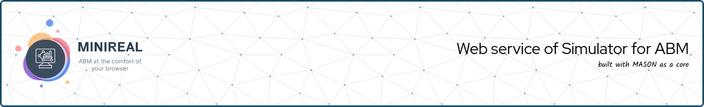

# WSim4ABM (MiniReal) documentation
This is a documentation for the deployment, usage and overall information
about the [WSim4ABM]() system. This documentation is made using Mkdocs
with Material theme.

## Running the documentation
This documentation is accessed through a browser. Thus it can be run in two
ways.
1. Deploy a docker container using the `docker-compose` file.
    * Simply run `docker-compose up -d --build`
2. Install the requried libraries and run it through a command.
    * Create the python virtual enviroment manager of your choice and activate it.
    * Install all the required libraries from the `requirements.txt`.
        - `pip install -r requirements.txt`
    * Run the mkdocs server.
        - `mkdocs serve`

After running the documentation in either of the above methods, the UI can
be accessed by navigating to port `8085` of the server.

* `localhost:8085`
* `<host_ip_address>:8085`
