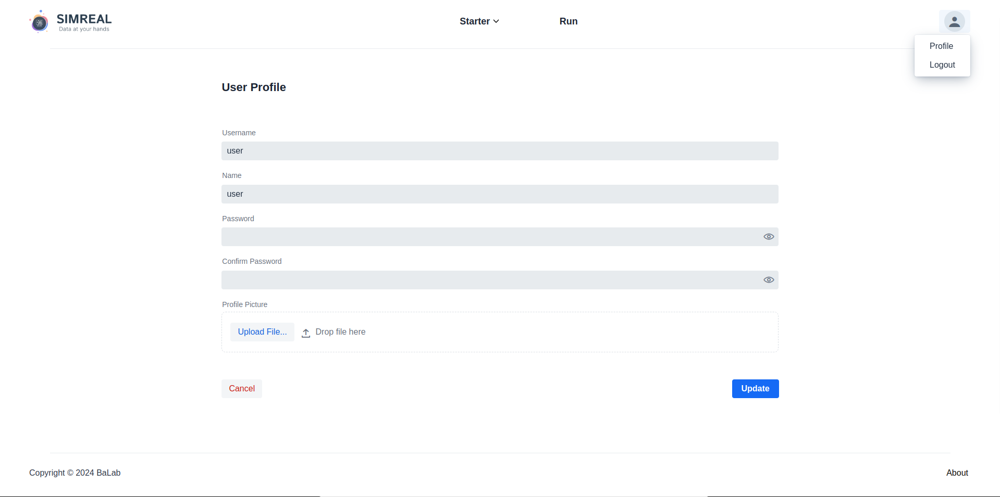

# User Account Management
User can navigate to their account setting by clicking on the avatar located in
top right side of the screen. The clicking on the `Profile` option will display
the `User Profile` page. Here users can update thier:

* username,
* name,
* password and,
* profile picture.

Also Users can delete thier user account from this page (todo).

{ align=center }

    Figure: User Profile setting page.

