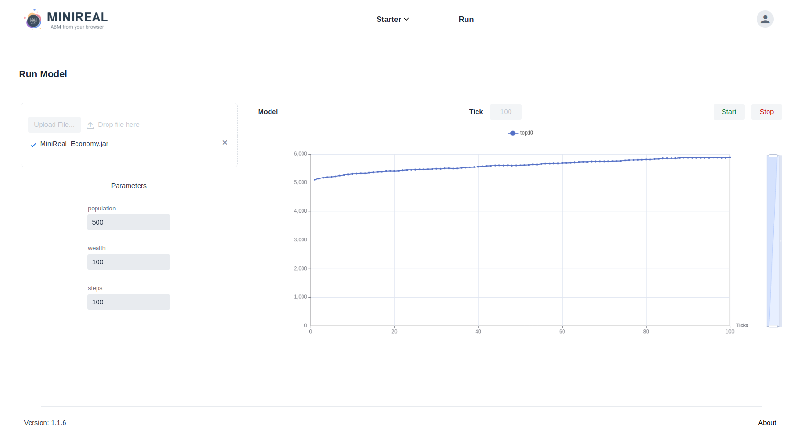

# Simulation Chart Annotation usage
The MiniReal system gives realtime visualization (insight) of simulation models through
a line chart on the browser. This line chart module receives an integer value from the
simulation on each tick and displays it accordingly. 

* The simulation model must have one or more methods that calculate some aggregate behaviour
and return an integer value for each tick.
* Then users have to annotate such methods with the `@SimChart` annotation. This annotation takes
argument with the keyword called `name` for the chart name. The value for this argument should be
passed as `String`.

```java title="Model.java"
import org.simreal.annotation.*;
import sim.engine.SimState;

@SimModel
public class Model extends SimState  {

    // rest of code

    @SimChart(name="chart_name")
	public int chartingMethod(){
        int result = 0;

        // perform operation to calculate and obtain integer representing ~
        // ~ aggregate simulation behaviour (update result)

        return result;
    }
}
```

## Example of Charting Annotation Usage
```java title="Model.java"
import org.simreal.annotation.*;
import sim.engine.SimState;
import sim.util.Bag;
import sim.util.IntBag;
import java.util.ArrayList;
import java.util.stream.Collectors;

@SimModel
public class Model extends SimState  {
	public static final long serialVersionUID = 1L;
	private int population;
	private Bag field;

    // rest of code

	public Model(@SimParam(value = "500") int population,
				 @SimParam(value = "100") int wealth) {
		super(System.currentTimeMillis());
		this.population = population;
	}

    // rest of code

    // define a charting method that calculates the total wealth of the top 10% ~
    // ~ wealthy population.
	@SimChart(name="top10")
	public int top10wealth(){
		// sort the bag of the population
		IntBag popln_wealth = new IntBag();
		// get the wealth in a intBag and sort it
		((ArrayList<Agent>) field.stream().collect(Collectors.toList()))
            .forEach((agt_arg) -> {
                Agent agt = agt_arg;
                popln_wealth.add(agt.getWealth());
		});
		popln_wealth.sort();
		// get the sum of the top 10% wealth
		int top10_wealth_sum = 0;
		int top10_sz = (int) (population * 0.1);
		for(int i=population-top10_sz; i<population; i++){	
            top10_wealth_sum += popln_wealth.get(i);  
        }
		return top10_wealth_sum;
	}
}
```

In the above code snippet, the `top10wealth` method returns the wealth value of the top 10%
the wealthiest agents in the [Economy Model](../sample_models/economy_sample_model.md) simulation 
(for more information see referenced model documentation). This value is received and charted 
on the MiniReal UI as shown below. The slider on the left can be used to narrow or widen the 
y-axis value range, hence zooming in or out of the chart.

{ align=center }
<p style="text-align: center; font-size: 0.75em;">
    Figure: Economy Model single chart visualization on MiniReal system.
</p>

## Multiple Charts for a Simulation
It is possible to define multiple charts for a single simulation inorder to get various insights.
This can be done by implementing multiple methods and annotating them with the `@SimChart` annotation.
The name of the chart passed to the annotation, however, should be unique to each chart. The charts will
be plt on the same grid differentiated by color.

```java title="Model.java"
import org.simreal.annotation.*;
import sim.engine.SimState;
import sim.util.Bag;
import sim.util.IntBag;
import java.util.ArrayList;
import java.util.stream.Collectors;

@SimModel
public class Model extends SimState  {
	public static final long serialVersionUID = 1L;
	private int population;
	private Bag field;

    // rest of code

	public Model(@SimParam(value = "500") int population,
				 @SimParam(value = "100") int wealth) {
		super(System.currentTimeMillis());
		this.population = population;
	}

    // rest of code

    // define a charting method that calculates the total wealth of the top 10% ~
    // ~ wealthy population.
	@SimChart(name="top10")
	public int top10wealth(){
		// sort the bag of the population
		IntBag popln_wealth = new IntBag();
		// get the wealth in a intBag and sort it
		((ArrayList<Agent>) field.stream().collect(Collectors.toList()))
            .forEach((agt_arg) -> {
                Agent agt = agt_arg;
                popln_wealth.add(agt.getWealth());
		});
		popln_wealth.sort();
		// get the sum of the top 10% wealth
		int top10_wealth_sum = 0;
		int top10_sz = (int) (population * 0.1);
		for(int i=population-top10_sz; i<population; i++){	
            top10_wealth_sum += popln_wealth.get(i);  
        }
		return top10_wealth_sum;
	}   

    // define a charting method that calculates the total wealth of the bottom ~
    // ~ 50% of the population in-terms of wealth.
    @SimChart(name="bottom50")
	public int bottom50wealth()	{
		// sort the bag of the population
		IntBag popln_wealth = new IntBag();
		// get the wealth in a intBag and sort it
		((ArrayList<Agent>) field.stream().collect(Collectors.toList()))
            .forEach((agt_arg) -> {
                Agent agt = agt_arg;
                popln_wealth.add(agt.getWealth());
		});
		popln_wealth.sort();
		// get the sum of the bootom 50% wealth
		int bottom50_wealth_sum = 0;
		int bottom50_sz = (int) (population * 0.5);
		for(int i=0; i<bottom50_sz; i++){	
            bottom50_wealth_sum += popln_wealth.get(i);	 
        }
		return bottom50_wealth_sum;
	}
}
```

The result of running the above model is shown below. Users can enable or disable
the display of each chart by clicking on the chart name.

{ align=center }
<p style="text-align: center; font-size: 0.75em;">
    Figure: Economy Model multiple charts visualization on MiniReal system.
</p>

!!! note
    Inorder not to overload the UI and keep it responsive, the chart will be updated within few seconds.
    Thus at the start of the simulation, charts may not appear for few ticks.

<p align="center"><strong>Happy Modeling!</strong></p>
