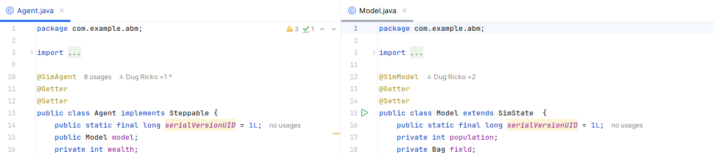

# Model and Agent Annotation usage
The `@SimModel` and `@SimAgent` annotations are used to mark the simulation `Model`
and `Agent` classes respectively. This information is used by the MiniReal Annotation Processor
library in the generation of the `Simulation Launcher` class.

These annotations should be placed on top of the `Model` and `Agent` classes.
The details of their specification is explained in the [Background](./antn_process_background.md)
page.

{ align=center }
<p style="text-align: center; font-size: 0.75em;">Figure: Usage of SimModel and SimAgent Annotations</p>


```java title="Model.java"
import org.simreal.annotation.*;
import sim.engine.SimState;

@SimModel
public class Model extends SimState  {
	
    // rest of code ...
}
```


```java title="Agent.java"
import org.simreal.annotation.SimAgent;
import sim.engine.Steppable;
import sim.engine.SimState;

@SimAgent
public class Agent implements Steppable {

    // rest of code ...
	
}
```
