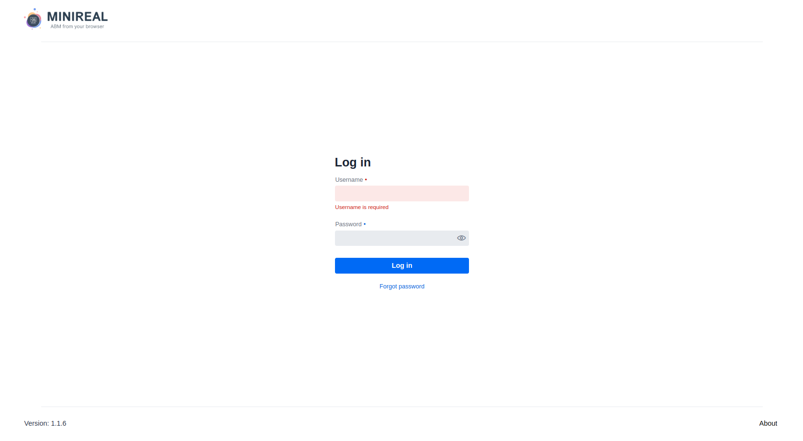

# Distributed Deployment

This section elaborates on how deploy the MiniReal system onto many servers in a distributed
manner.

---

## Requirements

Before getting on deploying the system two main components are needed to be
installed on the server.

- Docker
- Java JDK = 17

## Components

The components of the system required for the full functionality of MiniReal are:

- [The MiniReal Webservice system docker image](https://hub.docker.com/r/pazed/MiniReal)
- [A PostGREs database docker image](https://hub.docker.com/_/postgres)
- [An Apache Kafka broker docker image](https://hub.docker.com/r/confluentinc/cp-server)
- [Zookeeper service docker image to initialize Kafka broker](https://hub.docker.com/r/confluentinc/cp-zookeeper)

The order in which the components should be started is:

1. PostGREs and Zookeeper container
2. Kafka broker container
3. Once all the above services are confirmed to run then the MiniReal container can be started.

## Deploying Database service

The PostGREs database container can be deployed separately on any server
that is accessible to the MiniReal Service. The Docker YAML and environment variable files
should be placed in the same directory and their contents are shared below.

```yaml title="docker-compose.yml"
version: "3.3"

services:
  postgres:
    container_name: postgres
    image: postgres
    restart: unless-stopped
    environment:
      POSTGRES_USER: ${POSTGRES_USER}
      POSTGRES_PASSWORD: ${POSTGRES_PASSWORD}
      POSTGRES_MULTIPLE_DATABASES: ${POSTGRES_MULTIPLE_DATABASES}
    volumes:
      - ./postgre_data:/var/lib/postgresql/data
      - ./init-db.sh:/docker-entrypoint-initdb.d/init-db.sh
    ports:
      - "5432:5432"
```

The following `.env` file needs to be placed in the same directory as the `docker-compose` file
in order to inject the required environment variables to the container.

```bash title=".env"
POSTGRES_USER=root
POSTGRES_PASSWORD=example_pwd
POSTGRES_MULTIPLE_DATABASES=auth,sim,minireal
```

!!! note
The only value that needs to be updated in the above `.env` file is the `POSTGRES_PASSWORD`
variable.

Additionally, the PostGREs service also requires a startup bash script be placed with the Docker
compose file inorder to initialize the required databases for the MiniReal system. The script is
named `init-db.sh` as shown below.

```bash title="init-db.sh"
#!/bin/bash
set -e

# Create multiple databases
for db in ${POSTGRES_MULTIPLE_DATABASES//,/ }; do
    psql -v ON_ERROR_STOP=1 --username "$POSTGRES_USER" --dbname "$POSTGRES_DB" <<-EOSQL
        CREATE DATABASE $db;
EOSQL
done
```

The viewing and managing of this database is essential for smooth troubleshooting. The [pgAdmin](../supplimantory_software/pgadmin.md)
is a supplementing software used to achieve this and its documentation page has all the essential
information on how to deploy it with the PostgreSQL database.

## Deploying Message Broker service

The Apache Kafka Message broker also can be deployed on a separate server that can be accessed
by the MiniReal system. The Zookeeper and Kafka broker services, however, should be deployed
together on the same server. The Docker compose YAML and environment variable files are shared below.

```yaml title="docker-compose.yml"
version: "3.3"
services:
  zookeeper:
    image: confluentinc/cp-zookeeper:7.3.1
    hostname: zookeeper
    container_name: zookeeper
    ports:
      - "2181:2181"
    environment:
      ZOOKEEPER_CLIENT_PORT: 2181
      ZOOKEEPER_TICK_TIME: 2000

  broker:
    image: confluentinc/cp-server:7.3.1
    hostname: broker
    container_name: broker
    depends_on:
      - zookeeper
    ports:
      - "9092:9092"
      - "9101:9101"
    environment:
      KAFKA_BROKER_ID: 1
      KAFKA_ZOOKEEPER_CONNECT: "zookeeper:2181"
      KAFKA_LISTENER_SECURITY_PROTOCOL_MAP: PLAINTEXT:PLAINTEXT,PLAINTEXT_HOST:PLAINTEXT
      KAFKA_ADVERTISED_LISTENERS: PLAINTEXT://broker:29092,PLAINTEXT_HOST://${KAFKA_ADDRESS}:9092
      KAFKA_METRIC_REPORTERS: io.confluent.metrics.reporter.ConfluentMetricsReporter
      KAFKA_OFFSETS_TOPIC_REPLICATION_FACTOR: 1
      KAFKA_GROUP_INITIAL_REBALANCE_DELAY_MS: 0
      KAFKA_CONFLUENT_LICENSE_TOPIC_REPLICATION_FACTOR: 1
      KAFKA_CONFLUENT_BALANCER_TOPIC_REPLICATION_FACTOR: 1
      KAFKA_TRANSACTION_STATE_LOG_MIN_ISR: 1
      KAFKA_TRANSACTION_STATE_LOG_REPLICATION_FACTOR: 1
      KAFKA_JMX_PORT: 9101
      KAFKA_JMX_HOSTNAME: localhost
      KAFKA_CONFLUENT_SCHEMA_REGISTRY_URL: http://schema-registry:8081
      CONFLUENT_METRICS_REPORTER_BOOTSTRAP_SERVERS: broker:29092
      CONFLUENT_METRICS_REPORTER_TOPIC_REPLICAS: 1
      CONFLUENT_METRICS_ENABLE: "true"
      CONFLUENT_SUPPORT_CUSTOMER_ID: "anonymous"
```

The following `.env` file also needs to be configured for the Kafka container.
The `ip address` or `domain` of the server housing the Kafka broker needs to be
assgined to the `KAFKA_ADDRESS` variable.

```bash title=".env"
KAFKA_ADDRESS=<IP_address_of_server>
```

Monitoring the state of the kafka broker and its topics is very useful in troubleshooting.
The [Kafka Control Center](../supplimantory_software/kafka_control_center.md) is a software
used to monitor kafka cluster and broker states. Its documentation page has all the essential
information on how to deploy it with the broker and use it.

## Deploying MiniReal service

Once the Database and Message Broker services are up and running on their respective
server, the MiniReal System can be deployed on a computer that can access both of the
aforementioned services. Here the `ip` or `domain-name` of the pre-requisite services
should be used for a proper integration with them.

The content of the Docker compose and environment variables files for the MiniReal System
is shared below.

```yaml title="docker-compose.yml"
version: "3.3"
services:
  minireal:
    container_name: minireal
    image: pazed/minireal:latest
    restart: unless-stopped
    environment:
      KAFKA_ADDRESS: ${KAFKA_ADDRESS}
      KAFKA_PORT: ${KAFKA_PORT}
      POSTGRES_DB: ${POSTGRES_DB}
      POSTGRES_ADDRESS: ${POSTGRES_ADDRESS}
      POSTGRES_PORT: ${POSTGRES_PORT}
      POSTGRES_USER: ${POSTGRES_USER}
      POSTGRES_PASSWORD: ${POSTGRES_PASSWORD}
    ports:
      - 8090:8090
    volumes:
      - ./users_data:/usr/src/app/data
```

An `.env` file with the following content needs to be placed alongside the `docker-compose`
file specified above. The appropriate values need to be placed the enviroment variables.

```bash title=".env_minireal"
POSTGRES_ADDRESS=<IP_or_domain_of_db>
POSTGRES_PORT=5432
POSTGRES_USER=root
POSTGRES_PASSWORD=<db_password>
POSTGRES_DB=minireal
KAFKA_ADDRESS=<IP_or_domain_of_broker>
KAFKA_PORT=9092
```

## Docker containers deployment

After placing the Docker YAML and environment variable files in the same directory, run the
following command to deploy the respective services.

```bash
docker-compose up -d
```

Or in the recent Docker package this command is updated to:

```bash
docker compose up -d
```

## Finalizing deployment

Upon successful deployment, navigate to `<minireal_ip_address>:8090` to
obtain the login screen to the MiniReal system.

{ align=center }

Following the initial deployment one user with the `OWNER` privilege will be created. The
credentials for this user are:

- username: `owner`
- password: `changemepwd`

!!! warning
    After logging in for the first time, make sure to change the password of this user.
    It's advised to create another user with the role of `ADMIN` for the executing the
    operations of system management.
