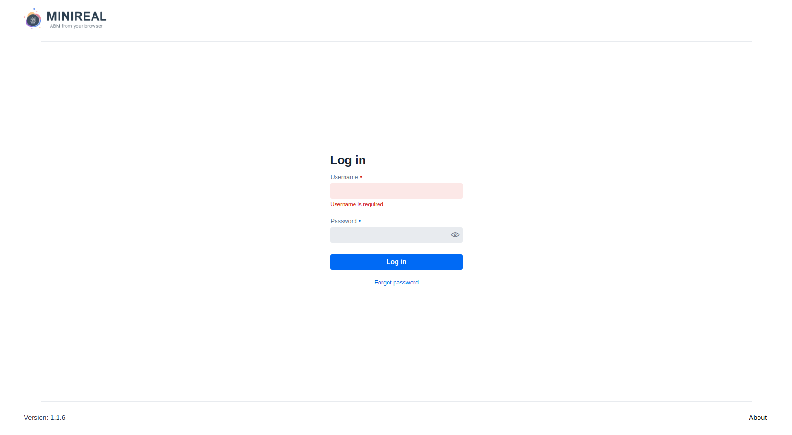

# Deployment on Single Server with Supplementary Software

This section elaborates on how deploy the MiniReal system onto a single server or High
Performance Computer (HPC) with all the components and supplementary software.

---

## Requirements

Before getting on deploying the system, two main components are needed to be
installed on the server.

- Docker
- Java JDK = 17

## Components

The components of the system required for the full functionality of MiniReal are:

- [The MiniReal Webservice system docker image](https://hub.docker.com/r/pazed/MiniReal)
- [A PostGREs database docker image](https://hub.docker.com/_/postgres)
- [An Apache Kafka broker docker image](https://hub.docker.com/r/confluentinc/cp-server)
- [Zookeeper service docker image to initialize Kafka broker](https://hub.docker.com/r/confluentinc/cp-zookeeper)

The order in which the components should be started is:

1. PostGREs and Zookeeper container
2. Kafka broker container
3. Once all the above services are confirmed to run then the MiniReal container can be started.

## Supplementary Software

Additional software and tools exist that make the monitoring of the MiniReal system, and it's component
much easier. These software are:

- [Apache Kafka Control Center](../supplimantory_software/kafka_control_center.md): to monitor and manage the
  kafka broker.
- [pgAdmin](../supplimantory_software/pgadmin.md): to monitor and manage the PostGre database.

This page includes these supplementing systems in the deployment docker-compose file.

## Docker YAML file

Since this section targets deployment of all services onto a single server, then all
services can be put to one Docker YAML configuration file as shown below.

```yaml title="docker-compose.yml"
version: "3.3"
services:
  minireal:
    container_name: minireal
    image: pazed/minireal:latest
    restart: unless-stopped
    environment:
      KAFKA_ADDRESS: ${KAFKA_ADDRESS}
      KAFKA_PORT: ${KAFKA_PORT}
      POSTGRES_DB: ${POSTGRES_DB}
      POSTGRES_ADDRESS: ${POSTGRES_ADDRESS}
      POSTGRES_PORT: ${POSTGRES_PORT}
      POSTGRES_USER: ${POSTGRES_USER}
      POSTGRES_PASSWORD: ${POSTGRES_PASSWORD}
    ports:
      - 8090:8090
    volumes:
      - ./users_data:/usr/src/app/data
    depends_on:
      - broker
      - postgres
    networks:
      - minireal_network

  zookeeper:
    image: confluentinc/cp-zookeeper:7.3.1
    hostname: zookeeper
    container_name: zookeeper
    ports:
      - "2181:2181"
    environment:
      ZOOKEEPER_CLIENT_PORT: 2181
      ZOOKEEPER_TICK_TIME: 2000
    networks:
      - minireal_network

  broker:
    image: confluentinc/cp-server:7.3.1
    hostname: broker
    container_name: broker
    depends_on:
      - zookeeper
    ports:
      - "9092:9092"
      - "9101:9101"
    environment:
      KAFKA_BROKER_ID: 1
      KAFKA_ZOOKEEPER_CONNECT: "zookeeper:2181"
      KAFKA_LISTENER_SECURITY_PROTOCOL_MAP: PLAINTEXT:PLAINTEXT,PLAINTEXT_HOST:PLAINTEXT
      KAFKA_ADVERTISED_LISTENERS: PLAINTEXT://broker:29092,PLAINTEXT_HOST://${KAFKA_ADDRESS}:9092
      KAFKA_METRIC_REPORTERS: io.confluent.metrics.reporter.ConfluentMetricsReporter
      KAFKA_OFFSETS_TOPIC_REPLICATION_FACTOR: 1
      KAFKA_GROUP_INITIAL_REBALANCE_DELAY_MS: 0
      KAFKA_CONFLUENT_LICENSE_TOPIC_REPLICATION_FACTOR: 1
      KAFKA_CONFLUENT_BALANCER_TOPIC_REPLICATION_FACTOR: 1
      KAFKA_TRANSACTION_STATE_LOG_MIN_ISR: 1
      KAFKA_TRANSACTION_STATE_LOG_REPLICATION_FACTOR: 1
      KAFKA_JMX_PORT: 9101
      KAFKA_JMX_HOSTNAME: localhost
      KAFKA_CONFLUENT_SCHEMA_REGISTRY_URL: http://schema-registry:8081
      CONFLUENT_METRICS_REPORTER_BOOTSTRAP_SERVERS: broker:29092
      CONFLUENT_METRICS_REPORTER_TOPIC_REPLICAS: 1
      CONFLUENT_METRICS_ENABLE: "true"
      CONFLUENT_SUPPORT_CUSTOMER_ID: "anonymous"
    networks:
      - minireal_network

  control-center:
    image: confluentinc/cp-enterprise-control-center:7.3.1
    hostname: control-center
    container_name: control-center
    depends_on:
      - broker
    ports:
      - "9021:9021"
    environment:
      CONTROL_CENTER_BOOTSTRAP_SERVERS: "broker:29092"
      CONTROL_CENTER_REPLICATION_FACTOR: 1
      CONTROL_CENTER_INTERNAL_TOPICS_PARTITIONS: 1
      CONTROL_CENTER_MONITORING_INTERCEPTOR_TOPIC_PARTITIONS: 1
      CONFLUENT_METRICS_TOPIC_REPLICATION: 1
      PORT: 9021
    networks:
      - minireal_network

  postgres:
    container_name: postgres
    image: postgres
    restart: unless-stopped
    environment:
      POSTGRES_USER: ${POSTGRES_USER}
      POSTGRES_PASSWORD: ${POSTGRES_PASSWORD}
      POSTGRES_MULTIPLE_DATABASES: ${POSTGRES_MULTIPLE_DATABASES}
    volumes:
      - ./postgre_data:/var/lib/postgresql/data
      - ./init-db.sh:/docker-entrypoint-initdb.d/init-db.sh
    ports:
      - "5432:5432"
    networks:
      - minireal_network

  pgadmin:
    container_name: pgadmin
    image: dpage/pgadmin4
    restart: unless-stopped
    environment:
      PGADMIN_DEFAULT_EMAIL: ${PGADMIN_DEFAULT_EMAIL:-pgadmin4@pgadmin.org}
      PGADMIN_DEFAULT_PASSWORD: ${PGADMIN_DEFAULT_PASSWORD:-admin}
      PGADMIN_CONFIG_SERVER_MODE: "False"
    volumes:
      - pgadmin:/var/lib/pgadmin
    ports:
      - "5050:80"
    networks:
      - minireal_network

networks:
  minireal_network:
    driver: bridge

volumes:
  pgadmin:
```

Inorder to ensure communication among these services, setting the required environment
variables is essential. The next section explains how to set them up.

## Required Environment Variables

The MiniReal system accepts the addresses of the PostGREs database and Kafka broker at runtime
(deployment). The database and broker services also require configuration on how
they accept requests, and they are identified. For this reason the following environment variables
need to be defined in a file in the same directory as the Docker YAML file.

```bash title=".env"
# set postgre variables
KAFKA_ADDRESS=broker

# set kafka variables
POSTGRES_USER=root
POSTGRES_PASSWORD=example_pwd
POSTGRES_MULTIPLE_DATABASES=auth,sim,minireal

# set minireal variables
KAFKA_PORT=9092
POSTGRES_DB=minireal
POSTGRES_ADDRESS=postgres
POSTGRES_PORT=5432
```

!!! note
The only value that needs to be updated in the above `.env` file is the `POSTGRES_PASSWORD`
variable.

Additionally, the PostGREs service also requires a startup bash script be placed with the Docker
compose file inorder to initialize the required databases for the MiniReal system. The script is
named `init-db.sh` as shown below.

```bash title="init-db.sh"
#!/bin/bash
set -e

# Create multiple databases
for db in ${POSTGRES_MULTIPLE_DATABASES//,/ }; do
    psql -v ON_ERROR_STOP=1 --username "$POSTGRES_USER" --dbname "$POSTGRES_DB" <<-EOSQL
        CREATE DATABASE $db;
EOSQL
done
```

!!! note
Since all the containers are on the same docker network, the names of the services
in the Docker YAML configuration can be used to identify their location.

## Deployment

After placing the Docker YAML and environment variable files in the same directory, run the
following command to deploy all the services.

```bash
docker-compose up -d
```

Or in the recent Docker package this command is updated to:

```bash
docker compose up -d
```

## Finalizing deployment

Upon successful deployment, navigate to `localhost:8090` or `<host_ip_address>:8090` to
obtain the login screen to the MiniReal system.

{ align=center }

Following the initial deployment one user with the `OWNER` privilege will be created. The
credentials for this user are:

- username: `owner`
- password: `changemepwd`

!!! warning
After logging in for the first time, make sure to change the password of this user.
It's advised to create another user with the role of `ADMIN` for the executing the
operations of system management.

The Kafka control center and pgAdmin supplementing software can be accessed as well.
Please refer to their respective documentation on how to access their respective UI.

- [Kafka control center](../supplimantory_software/kafka_control_center.md)
- [pgAdmin](../supplimantory_software/pgadmin.md)
