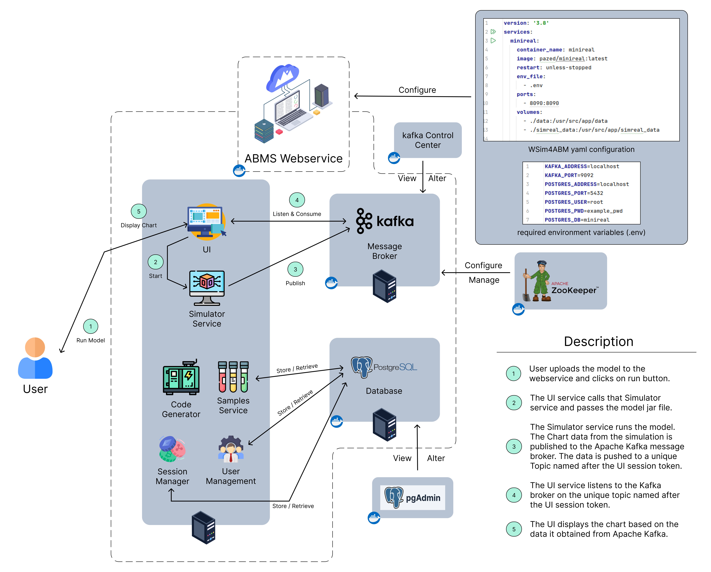

# Welcome to WSim4ABM (MiniReal)
This is a WebService of Simulator for Agent-based Modeling, shortly 
called `WSim4ABM` or `MiniReal`. This opensource project houses remote access to High 
Performance Computing (HPC) resources through browser based visualization for 
ABM simulations along with other services.

    <a href="https://github.com/balab-abms/minireal">Source Code</a>  |   <a href="https://www.sciencedirect.com/science/article/pii/S2352711025001402">Paper</a>

!!! note
    Regarding the naming of the system, it is given two names:

    * The formal name is `WSim4ABM`, which stands for Web Service of Simulator for ABM. 
    This name captures all the major aspects of this system.
    * The developers of the system have also given it a nickname, `MiniReal`, which 
    informally stands for Mini Real-time Simulator for ABM.

    Both names will be used interchangeably in this documentation to refer to the focal 
    system of this documentation.

## Introduction
WSim4ABM (MiniReal) is a web-based simulation platform for Agent-Based Modeling (ABM), 
built on top of the MASON simulation library for its extensibility, flexibility, and 
compatibility with Java ecosystems. The platform enables users to create, configure, 
and run ABM simulations seamlessly, both locally and on remote HPC resources. 
Key features include:

* **Web Interface and User Management**: Supports account management and secure access.
* **ABM Development Workflow**: Users can download sample ABM templates, develop simulations 
locally, and export them as runnable JAR files via Gradle.
* **Remote Simulation Execution**: Supports uploading and running simulations on remote HPC 
resources with real-time output visualization, including interactive charts.
* **Dynamic Parameter Configuration**: Allows users to adjust model parameters directly from 
the web interface without code modifications, using custom annotations and a dedicated annotation processor.
* **Robust Communication**: Utilizes Message Broker middleware to ensure stability and scalability 
in interactions between the simulation engine and the User Interface.
* **Dockerized Deployment**: The entire system is containerized for streamlined deployment on HPC environments.
WSim4ABM provides an end-to-end solution for developing, running, and visualizing ABM simulations, 
enhancing accessibility and scalability for researchers and developers.

{ align=center }

    Figure: Overall system architecture

## Documentation Structure
This documentation houses all the information needed to deploy and uitilize the MiniReal system.
It is structured as follows:

* The `Getting Started` section shares a short way to get the system up and run simulations.
* The `Deployment` section shows detailed steps how deploy the MiniReal system both on a single
and distributed servers manner.
* The `Annotation Processing` section gives detials on the `Annotations` available and how
to use them.
* The `Project Generation` section shows how to obtain the `Gradle` based projects to get started
with modeling.
* The `Running Simulations` section explains the steps to take when compiling model jar file and
run it on the MiniReal UI.
* The problem in focus and modeling techniques & insights for the sample models found on the MiniReal system
is described in the `Sample Models` section.
* The actions users can take on their accounts is explained in the `User Account Management` section.
* The actions that system administrators can take in managing a deployed MiniReal System is described in
the `System Administration` section.
* There are supplimantory softwares that make the monitoring of parts of the MiniReal system easier. The
`Supplimantory Softwares` section shares information on this.
* Other informations about the system and this documentation are placed in the `Others` section.

## Relevant Repositories
To realize the MiniReal system various modules and code have been implemented. Here is a list of 
the relevant repositories:

* [System source code](https://github.com/balab-abms/minireal)
* [Annotation processor source code](https://github.com/balab-abms/minireal-annotation-processing)
* [Sample models source codes](https://github.com/balab-abms/minireal-sample-models)
* [Documentation site source code](https://github.com/balab-abms/minireal-mkdocs)

<strong>Happy Modeling!</strong>
