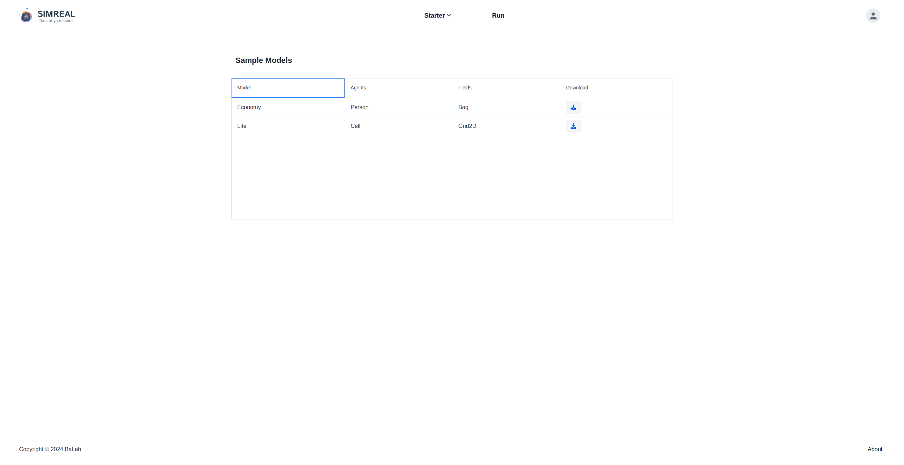
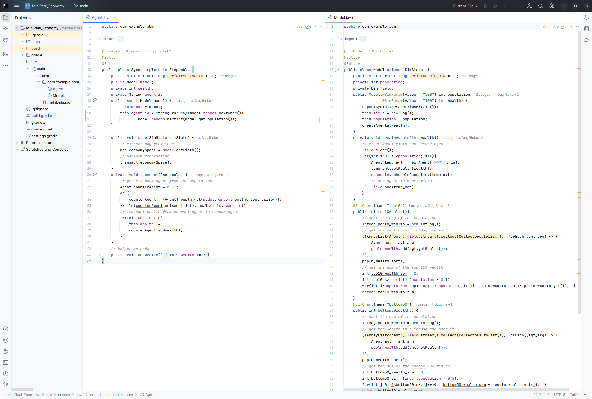

# Generate ABM Project from Sample Models
The workflow proposed by this system relaies on the utilization of Gradle for depenedency injection and management. Thus to alleiviate the burden from the user of initializing a Gradle project with all the needed libraries and structure, it can be obtained existing `Sample ABM Models` found on the MiniReal system.

## Download Sample ABM Project
1. The first step to getting started is to login to the MiniReal webservice and navigate to the `Sample Models` page, which is the welcome page when a user logs into the system. Alternatively this page can be reached by clicking on the `Starter` option on the navigation bar and selecting `Samples`. 
    

2. The next step is to click on the download button for the model of choice. A compressed file with all the model code and project structure will be presented to user for download.

## ABM modeling in Local enviroment
Once the Sample model project is downloaded, it can be extracted and opened in `Intellij Idea` IDE.

The above image shows the `Economy Model`. The details of the modeling and implementation for this sample is discussed in [Economy Model](../sample_models/economy_sample_model.md) page.

User can use this sample model as starting point for their modeling journey.

* They can build ontop the sample model to gain further insights on the target issue.
* They can remove the model and agent codes all-together and start from scratch for the modeling scenario they have in mind. Here the sample projects serves as a way to get a properly initialized project with MiniReal, MASON and related libraries.

<strong>Happy Modeling!</strong>
