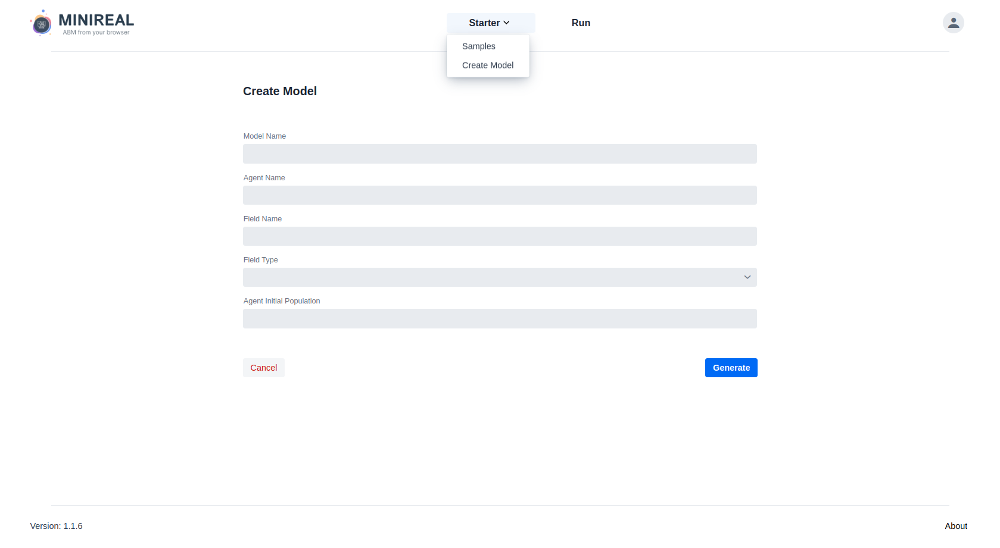
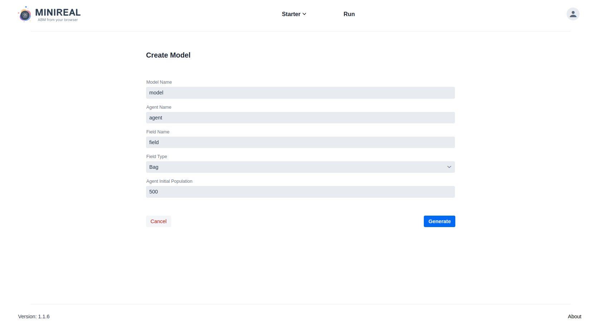
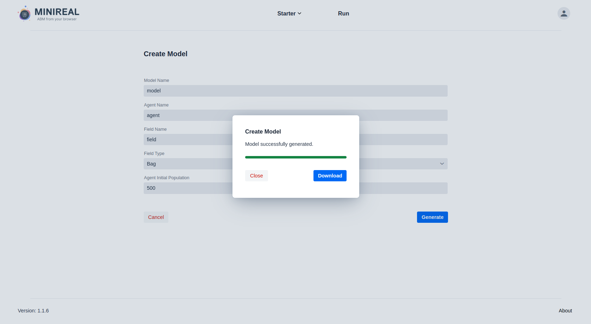
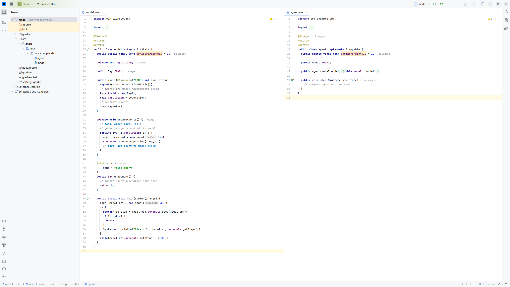

# Generate ABM Project from Template Form

The workflow proposed by this system relies on the utilization of Gradle for dependency
injection and management. Thus, to alleviate the burden from the user of initializing a Gradle
project with all the needed libraries and structure, the MiniReal system has a page and service
dedicated for project generation tailored to each user's need.

## Generate & Download ABM Project
1. The first step to getting started is to log in to the MiniReal webservice and navigate to the
`Create Model` page. This can be done by clicking on the `Starter` option on the navigation bar
and selecting `Create Model`.
    

2. The next step is to fill the form properly .
    * The `Model Name`, `Agent Name`, and `Field Name` fields can be filled with any valid Java
    variable identifier name.
    * The `Field Type` gives three options for the simulation space that will hold the agents.
    These options are: `Bag`, `Grid2D`, and `Continous3D`. These fields are specific and suited to
    MASON. If the user wishes to use other model space types, that is possible to achieve by changing
    them after downloading the template project.
    * The `Agent Initial Population` field accepts Integer numbers for the size of the agent population.
    

3. After filling the form, click on the `Generate` button and wait for the ABM Project generation
process to finish. The user then can obtain a zipped (compressed) file of the generated model by clicking on the 
`Download` button.
    

## ABM modeling in Local environment
Once the generated model is downloaded, it can be extracted and opened in `Intellij Idea` IDE.

The above image shows the structure of Template ABM code-base obtained from the MiniReal system.

* On the left is the `Model` class code and on the right is the `Agent` class code.
* It shows the placement and usage of all the MiniReal Annotations.
* The `createAgent` method in the `model` class is placed to guide the user populate agents as needed.
* The `drawChart` method is where the appropriate value for the charting is provided. The name of the method
can be changed, however the usage of `SimChart` annotation is required.
* The model parameters can be defined as the parameters of the class constructor and annotated with `SimParam`
Annotation.
* The `main` method in the `model` class can be used to run and test the model on a local environment to ensure
the correct implementation of it. After downloading and opening the generated model for the first time, users can
run the `main` method to check if everything is working well.
* The `step` method in the `agent` class is where the behaviours or actions of Agents is placed.

<strong>Happy Modeling!</strong>
