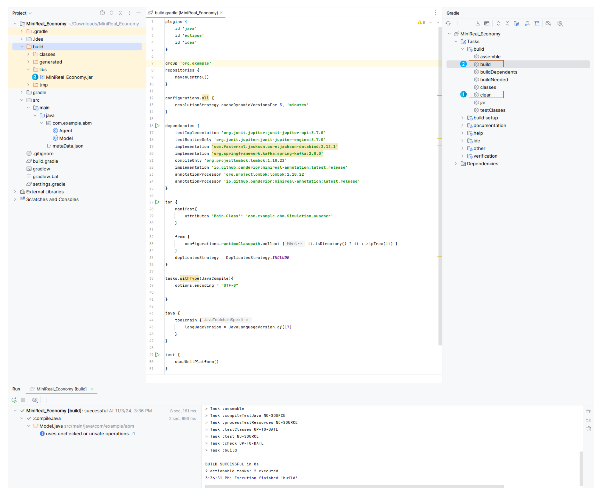
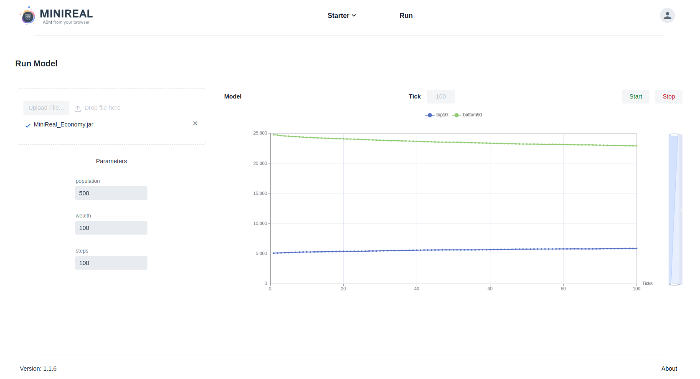

# Running Simulations
Once modeling is completed on the local environment, users need to compile
the model `jar` file and upload it to the MiniReal system in order to run it.
The following subsections of this page, describe each of the steps in detail.

---
## Compiling Model JAR file
The running of a simulation model is made possible by uploading a compiled
`jar` file of its project. This `jar` file can be obtained in two ways. 

### Option 1: Using Gradle plugin on Intellij IDE
The first and easy way is through the UI in the IDE. For instance in `Intellij Idea`
there exists a tab for `Gradle` projects on the right-hand-side. After opening that tab
users can navigate to the `build` section of the project Gradle actions. 

!!! note
    For this approach to work, the Project SDK (Software Development Kit)  has to be 
    properly set in Intellij to point to JDK 17. The [Setting Project SDK in Intellij](./troubleshooting/set_intellij_sdk.md) 
    page provides the steps needed to ensure the correct Java version is set in the IDE.

* After expanding the `build` section, users can first run the `clean` option
by double-clicking on it. This will remove any existing compilation made for the project.
This highlighted as step-1 in the following image.
* Thereafter, users can run the `build` command by double-clicking on it. This shown as step
-2 on the following image.
* After the completion of the compilation stage, the model `jar` file will be located in the
following folder.
    - `build` -> `libs` -> `jar file`

{ align=center }

    Figure: Compiling Model jar file from IDE UI

### Option 2: Using terminal commands
The second option is by using terminal commands. Users should open a terminal (shell) which
is pointing or opened on the Model project root directory. 

!!! note
    Java 17 JDK needs to be install on the user PC inorder to run the Gradle commands sucessfully.
    The specified Java JDK can be installed following the instructions on the 
    [Java installation guide](./troubleshooting/install_jdk.md) page.

There users can run the following two
commands to `clean` and `build` the ABM Model Gradle project in the mentioned order.

* `./gradlew clean`
* `./gradlew build`

.png){ align=center }

    Figure: Compiling Model jar file using terminal commands

---
## Running Simulation Model
Once the model project is compiled and the respective `jar` file is generated, then next step is to
navigate to the `Run` page on the MiniReal system UI and uploading this `jar` file. Once the system
recognizes the model from the jar file, users can tweak the model parameters as they wish on the UI 
and hit the `Start` button to run their simulation.

{ align=center }

    Figure: Running model jar file on the MiniReal system UI

