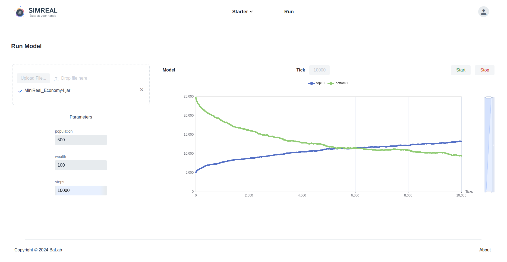

# Economy Sample Model
The Simple Economy model represents an ecosystem with a fixed amount of money 
distributed equally among all agents (representing individuals). In each tick of 
the simulation, an agent gives one unit of money to a randomly selected agent. 

The experiment explores how wealth distribution evolves over time, providing an 
abstract framework to study the factors that influence wealth distribution in society.

## Model
When designing a use case in Agent-Based Modeling (ABM), several key aspects must be 
considered: `model parameters`, `agent space`, and `output observation`. In the Simple Economy model, 
parameters include the `agent population size` and `initial wealth`, and varying these allows 
insights into system behavior.

The model’s space or field structure defines agent interaction. For the Simple Economy model, 
a one-dimensional space suffices, as agents only need to be randomly selected for wealth exchanges. 
Here, the `MASON` library’s `Bag`—a resizable linear array—is an effective data structure.

Finally, determining how to observe the system’s state is crucial. For the Economy model visualizaton, 
the system’s aggregate behavior is calculated and annotated using two methods: 

* one sums the wealth of the top 10% of agents, 
* while the other sums the wealth of the bottom 50% of the population.

```java title="Model.java"
import lombok.Getter;
import lombok.Setter;
import org.simreal.annotation.*;
import sim.engine.SimState;
import sim.util.Bag;
import sim.util.IntBag;
import java.util.ArrayList;
import java.util.stream.Collectors;

@SimModel
@Getter
@Setter
public class Model extends SimState  {
	public static final long serialVersionUID = 1L;
	private int population;
	private Bag field;
	public Model(@SimParam(value = "500") int population,
				 @SimParam(value = "100") int wealth) {
		super(System.currentTimeMillis());
		this.field = new Bag();
		this.population = population;
		createAgents(wealth);
	}
	private void createAgents(int wealth){
		// clear model field and create agents
		field.clear();
		for(int i=0; i <population; i++){
			Agent temp_agt = new Agent(this);
			temp_agt.setWealth(wealth);
			schedule.scheduleRepeating(temp_agt);
			// add agent to model field
			field.add(temp_agt);
		}
	}
	@SimChart(name="top10")
	public int top10wealth(){
		// sort the bag of the population
		IntBag popln_wealth = new IntBag();
		// get the wealth in a intBag and sort it
		((ArrayList<Agent>) field.stream().collect(Collectors.toList())).forEach((agt_arg) -> {
			Agent agt = agt_arg;
			popln_wealth.add(agt.getWealth());
		});
		popln_wealth.sort();
		// get the sum of the top 10% wealth
		int top10_wealth_sum = 0;
		int top10_sz = (int) (population * 0.1);
		for(int i=population-top10_sz; i<population; i++){	top10_wealth_sum += popln_wealth.get(i);  }
		return top10_wealth_sum;
	}
	@SimChart(name="bottom50")
	public int bottom50wealth()	{
		// sort the bag of the population
		IntBag popln_wealth = new IntBag();
		// get the wealth in a intBag and sort it
		((ArrayList<Agent>) field.stream().collect(Collectors.toList())).forEach((agt_arg) -> {
			Agent agt = agt_arg;
			popln_wealth.add(agt.getWealth());
		});
		popln_wealth.sort();
		// get the sum of the bootom 50% wealth
		int bottom50_wealth_sum = 0;
		int bottom50_sz = (int) (population * 0.5);
		for(int i=0; i<bottom50_sz; i++){	bottom50_wealth_sum += popln_wealth.get(i);	 }
		return bottom50_wealth_sum;
	}
	public static void main(String[] args) {
		Model model_obj = new Model(50, 50);
		do {
			boolean is_step = model_obj.schedule.step(model_obj);
			if(!is_step) {	break;	}
			System.out.println("tick = " + model_obj.schedule.getSteps());
		} while(model_obj.schedule.getSteps() < 100);
	}
}
```
The code structure of the `Model` class is discribed as follows:

* The class contructor accepts parameters and calls the agent populating method named
`createAgents`.
* The `createAgents` method populates the `Model` field with the specified population size.
* The `top10wealth` and `bottom50wealth` are charting methods that return values 
representing the aggrigate behaviour they target.

## Agents
In the Simple Economy model, agents represent individuals within a society. Each day, 
an agent with wealth gives one unit of money to a randomly selected agent from the 
simulation’s `Bag` field. If an agent has no money, it takes no action. This action is
defined in the `step` function.

```java title="Agent.java"
import lombok.Getter;
import lombok.Setter;
import org.simreal.annotation.SimAgent;
import sim.engine.Steppable;
import sim.engine.SimState;
import sim.util.Bag;

@SimAgent
@Getter
@Setter
public class Agent implements Steppable {
	public static final long serialVersionUID = 1L;
	public Model model;
	private int wealth;
	private String agent_id;
	public Agent(Model model) {
		this.model = model;
		this.agent_id = String.valueOf(model.random.nextChar()) +
				model.random.nextInt(model.getPopulation());
	}

	public void step(SimState simState) {
		// extract bag from model
		Bag economySpace = model.getField();
		// perform transaction
		transact(economySpace);
	}
	private void transact(Bag popln) {
		// get a random agent from the population
		Agent counterAgent = null;
		do {
			counterAgent = (Agent) popln.get(model.random.nextInt(popln.size()));
		}while(counterAgent.getAgent_id().equals(this.agent_id));
		// transact wealth from current agent to random_agent
		if(this.wealth > 0){
			this.wealth -= 1;
			counterAgent.addWealth();
		}
	}
	// helper methods
	public void addWealth()
	{
		this.wealth +=1;
	}
}
```

## Simulation Insight
The Economy model was simulated for `10,000` ticks with an agent population of `500`, 
each starting with `100` units of wealth. The charts below, generated by the MiniReal 
System, show the wealth of the `top 10%` and the `bottom 50%` of agents. Around ticks 
`5600 to 5800`, the wealth of these groups equalizes. After this point, the `top 10%` 
consistently outpaces the `bottom 50%`, with the gap widening over time. Despite its 
simplicity, this random exchange model reflects real-world wealth disparities. By 
adding and adjusting parameters, this model could further explore ways to reduce 
wealth inequality in society.

{ align=center }
<p style="text-align: center; font-size: 0.75em;">
    Figure: Economy Model simulation insight.
</p>
