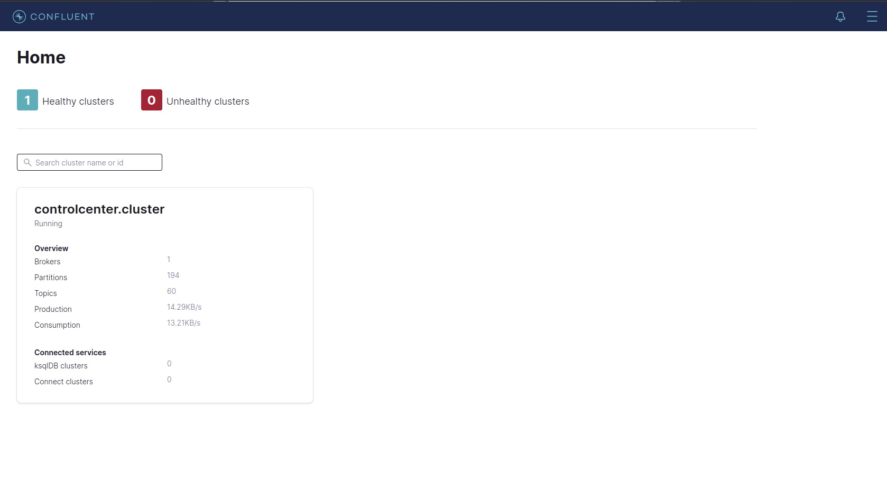
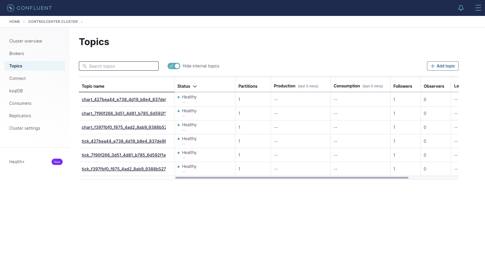
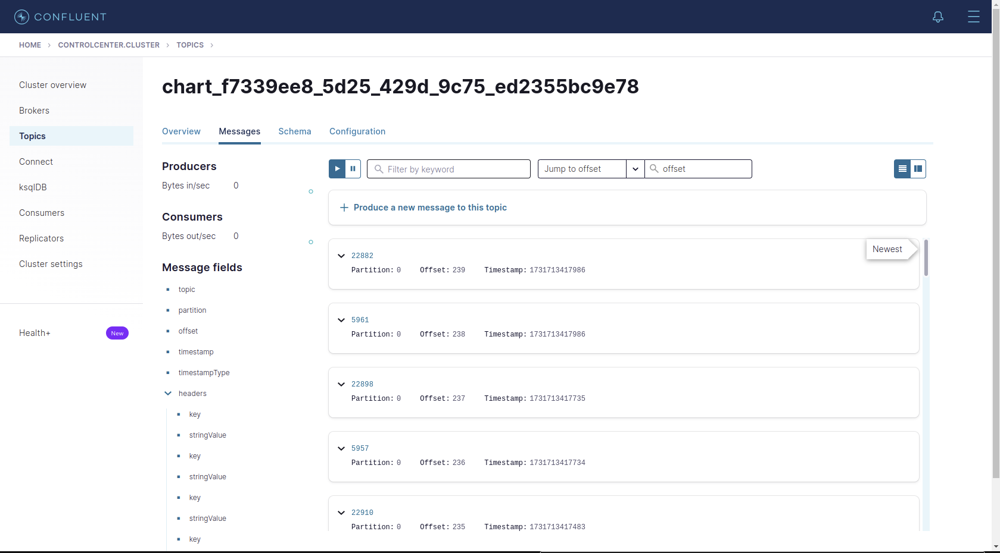

# Kafka Control Center
Kafka Control Center is a web-based tool designed to manage and monitor Apache
Kafka clusters or brokers. It provides an intuitive user interface for cluster management, 
message inspection, and Schema Registry integration.

In the case of MiniReal, the Control Center can be used to view the health of
the Kafka broker and monitor the data being passed through the topics.
---
## Deployment
The following docker-compose file includes the `Zookeeper` and `Apache Kafka Broker` containers
in addition to the `Apache Kafka Control Center`, since the initial two services are prerequisite
for the Control Center.

``` yaml title="docker-compose"
version: '3.3'
services:
  zookeeper:
    image: confluentinc/cp-zookeeper:7.3.1
    hostname: zookeeper
    container_name: zookeeper
    ports:
      - "2181:2181"
    environment:
      ZOOKEEPER_CLIENT_PORT: 2181
      ZOOKEEPER_TICK_TIME: 2000

  broker:
    image: confluentinc/cp-server:7.3.1
    hostname: broker
    container_name: broker
    depends_on:
      - zookeeper
    ports:
      - "9092:9092"
      - "9101:9101"
    environment:
      KAFKA_BROKER_ID: 1
      KAFKA_ZOOKEEPER_CONNECT: 'zookeeper:2181'
      KAFKA_LISTENER_SECURITY_PROTOCOL_MAP: PLAINTEXT:PLAINTEXT,PLAINTEXT_HOST:PLAINTEXT
      KAFKA_ADVERTISED_LISTENERS: PLAINTEXT://broker:29092,PLAINTEXT_HOST://${KAFKA_ADDRESS}:9092
      KAFKA_METRIC_REPORTERS: io.confluent.metrics.reporter.ConfluentMetricsReporter
      KAFKA_OFFSETS_TOPIC_REPLICATION_FACTOR: 1
      KAFKA_GROUP_INITIAL_REBALANCE_DELAY_MS: 0
      KAFKA_CONFLUENT_LICENSE_TOPIC_REPLICATION_FACTOR: 1
      KAFKA_CONFLUENT_BALANCER_TOPIC_REPLICATION_FACTOR: 1
      KAFKA_TRANSACTION_STATE_LOG_MIN_ISR: 1
      KAFKA_TRANSACTION_STATE_LOG_REPLICATION_FACTOR: 1
      KAFKA_JMX_PORT: 9101
      KAFKA_JMX_HOSTNAME: localhost
      KAFKA_CONFLUENT_SCHEMA_REGISTRY_URL: http://schema-registry:8081
      CONFLUENT_METRICS_REPORTER_BOOTSTRAP_SERVERS: broker:29092
      CONFLUENT_METRICS_REPORTER_TOPIC_REPLICAS: 1
      CONFLUENT_METRICS_ENABLE: 'true'
      CONFLUENT_SUPPORT_CUSTOMER_ID: 'anonymous'

  
  control-center:
    image: confluentinc/cp-enterprise-control-center:7.3.1
    hostname: control-center
    container_name: control-center
    depends_on:
      - broker
    ports:
      - "9021:9021"
    environment:
      CONTROL_CENTER_BOOTSTRAP_SERVERS: 'broker:29092'
      CONTROL_CENTER_REPLICATION_FACTOR: 1
      CONTROL_CENTER_INTERNAL_TOPICS_PARTITIONS: 1
      CONTROL_CENTER_MONITORING_INTERCEPTOR_TOPIC_PARTITIONS: 1
      CONFLUENT_METRICS_TOPIC_REPLICATION: 1
      PORT: 9021
```
The following environment variables file needs to be placed in the same
directory as the docker-compose file.

```bash title=".env"
KAFKA_ADDRESS=<IP_address_of_server>
```

---
## Web UI
The web UI for the Kafka Control Center can be access by going to the address:

* ``` http://localhost:9021 ```
* ``` http://[host_ip_address]:9021 ```

{ align=center }
<p style="text-align: center; font-size: 0.75em;">
    Figure: Apache Kafka Control Center Welcome Screen
</p>

### Monitoring Kafka Topics
The MiniReal system hugely relies on the `Topics` of the Kafka broker. Thus, the control center is 
mainly used to observe and monitor the state of the `Topics`. The list of `Topics` currently
being managed by the broker can be reached by the following steps.

* Click on the cluster found in the Home page.
* Click on `Topics` option on the left hand-side drawer, and this will display all the topics.

!!! note
    Topics are continuously created and deleted based on simulation sessions, thus they are temporary.
    Should the list of Topics increase too much, system admins can delete them from the Control Center.

{ align=center }
<p style="text-align: center; font-size: 0.75em;">
    Figure: List of Topics on Kafka broker
</p>

### Monitoring Simulation Data
The simulation charting data passes through the Kafka broker inorder to reach the MiniReal UI. This data 
can be monitored by clicking on the correct `Topic` name on the Control Center and navigating to the
`Messages` tab. 

{ align=center }
<p style="text-align: center; font-size: 0.75em;">
    Figure: Simulation data being communicated through Kafka Topic
</p>