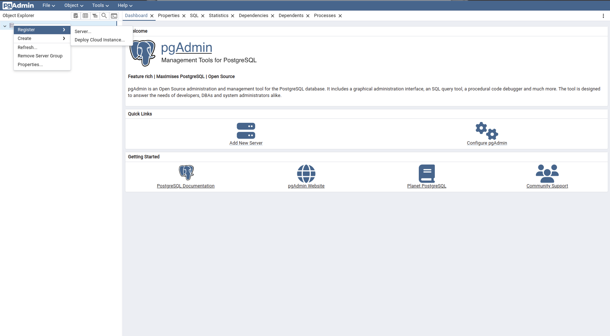
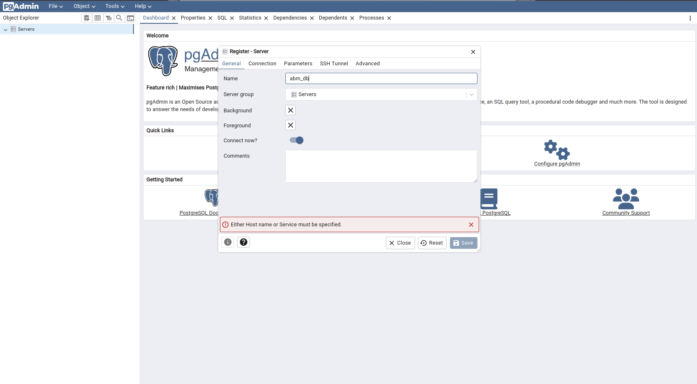
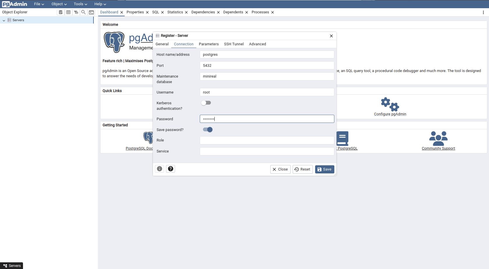
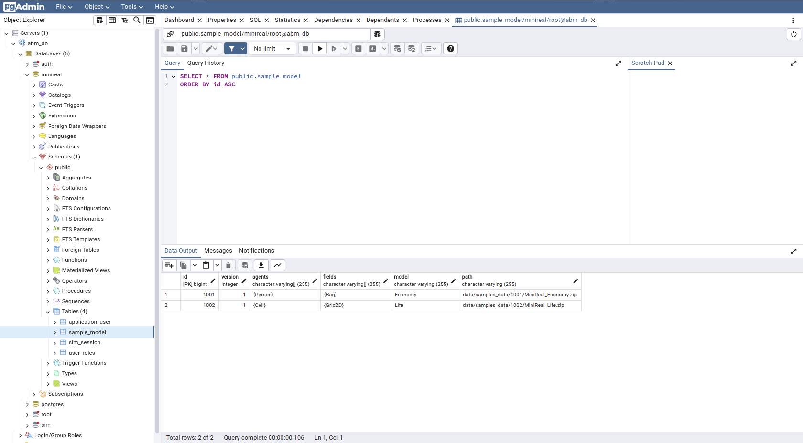
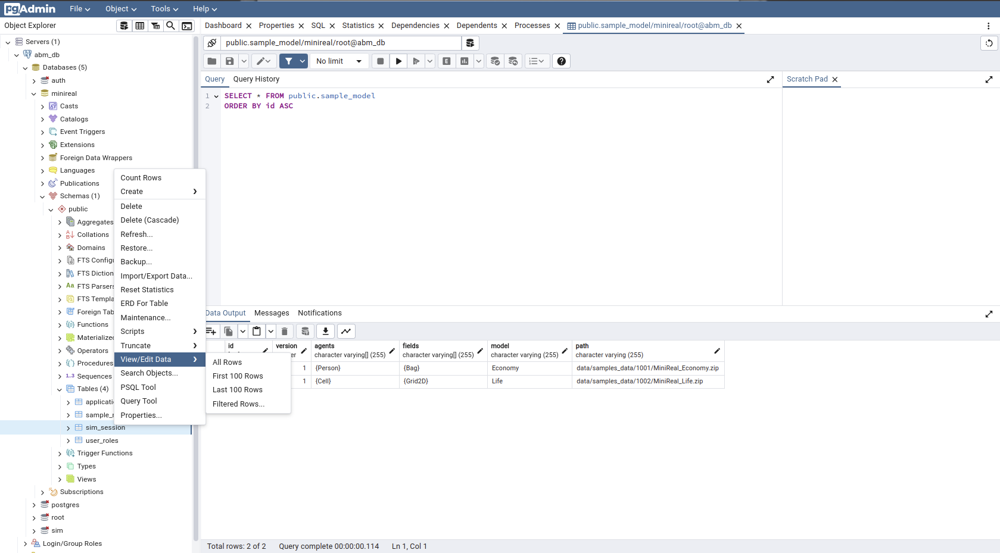

# pgAdmin

pgAdmin is an open-source tool designed for managing PostgreSQL databases, offering 
a comprehensive graphical user interface. It simplifies tasks such as database creation, 
management, querying, and maintenance, making it accessible for both novice and experienced 
users.

* [pgAdmin official page](https://www.pgadmin.org/)
* [pgAdmin Docker container](https://hub.docker.com/r/dpage/pgadmin4)

Since the database for WSim system is based on PostgreSQL, pgAdmin can be used to
manage that database.
---
## Deployment
The pgAdmin can be deployed onto the same docker-network with the PostgreSQL container
for a smooth integration. The following docker-compose file shows an integrated deployment
of the pgAdmin container with the respective database.

``` yaml title="docker-compose.yml"
version: '3.8'

services:
  postgres:
    container_name: postgres
    image: postgres
    environment:
      POSTGRES_USER: root
      POSTGRES_PASSWORD: example_pwd_changeme
      POSTGRES_MULTIPLE_DATABASES: auth, sim, minireal
      PGDATA: /data/postgres
    volumes:
      - postgres:/data/postgres
      - ./init-db.sh:/docker-entrypoint-initdb.d/init-db.sh

    ports:
      - "5432:5432"
    networks:
      - postgres
    restart: unless-stopped

  pgadmin:
    container_name: pgadmin
    image: dpage/pgadmin4
    environment:
      PGADMIN_DEFAULT_EMAIL: ${PGADMIN_DEFAULT_EMAIL:-pgadmin4@pgadmin.org}
      PGADMIN_DEFAULT_PASSWORD: ${PGADMIN_DEFAULT_PASSWORD:-admin}
      PGADMIN_CONFIG_SERVER_MODE: 'False'
    volumes:
      - pgadmin:/var/lib/pgadmin
    ports:
      - "5050:80"
    networks:
      - postgres
    restart: unless-stopped

networks:
  postgres:
    driver: bridge

volumes:
  postgres:
  pgadmin:

```

Additionally the PostgreSQL service also requires a startup bash script be placed with the Docker
compose file inorder to initialized the required databases for the SimReal system. The script is
named `init-db.sh` as shown below.

```bash title="init-db.sh"
#!/bin/bash
set -e

# Create multiple databases
for db in ${POSTGRES_MULTIPLE_DATABASES//,/ }; do
    psql -v ON_ERROR_STOP=1 --username "$POSTGRES_USER" --dbname "$POSTGRES_DB" <<-EOSQL
        CREATE DATABASE $db;
EOSQL
done
```

---
## Web UI
The web UI for the pgadmin can be access by going to the address:

* ``` http://localhost:5050 ```
* ``` http://[host_ip_address]:5050 ```

Upon initial access, the pgAdmin site will request for a global UI
password to secure it. This password is set only once on the initial
access and must not be forgotten.

After the setting of the pgAdmin UI password, the following actions can be taken
to integrate the PostgreSQL database with it.

### Adding a database server
The following steps can be taken to navigate to the UI that will help to register the
PostgreSQL database container.

1. Right click on the `Servers` option found on the left pannel of the screen.
2. Hover over the `Register` option found in the context window that pops up.
3. Then click on `Server...` option from the new options that show up.

{ align=center }
<p style="text-align: center; font-size: 0.75em;">
    Figure: Navigating to database server integrating page
</p>

Thereafter, a new small window named `Register - Server` will pop up. Here the name of choice
for the db integration can be entered in the `Name` field. Then navigate to the `Connection` tab
to enter the details of the PostgreSQL database.

{ align=center }
<p style="text-align: center; font-size: 0.75em;">
    Figure: Setting db connection name
</p>

On the `Connection` tab, the following information should be set:

* Set `Host name/address` as `postgres`.
    - This is the service name in the docker-compose file. The usage of such service name for
    address is possible since both the pgAdmin and PostgreSQL containers are on the same docker-
    network.
* Set `Port` to `5432`.
* Set `Maintenance database` as `minireal`.
    - This is the database that WSim will use to store all the systm data. The creation of this database
    is handled by the `init-db.sh` script.
* Set `Username` as `root`.
* Enter the password set for the PostgreSQL database to the `Password` field.
* Enable the `Save password?` toggle button.
* Finally click on the `Save` button to complete the integration.

!!! note
    The above information is set base on the `docker-compose` file shared in the previous section.
    Any changes made to the docker configuration file should be refelected in the form specified above
    as well.


{ align=center }
<p style="text-align: center; font-size: 0.75em;">
    Figure: Filling out the connection details of the Postgre database
</p>

### Exploring the database and tables
The tables for the WSim system can be obtained by navigating the pgAdmin UI as follows.
`connection name` -> `Databases` -> `minireal` -> `Schemas` -> `public` -> `Tables`


{ align=center }
<p style="text-align: center; font-size: 0.75em;">
    Figure: Navigating the pgAdmin page to get relevant database tables
</p>

The data in each table can be access through the following steps.

`Right click on the table` -> `View/Edit Data` -> `All Rows`


{ align=center }
<p style="text-align: center; font-size: 0.75em;">
    Figure: Viewing database table data
</p>

