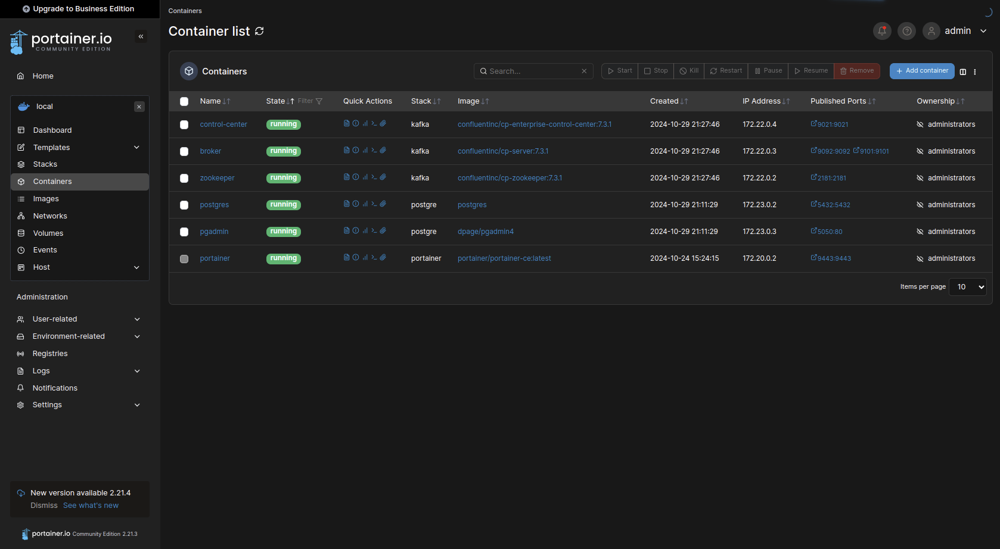

# Portainer
Portainer is a user-friendly platform designed to simplify the management of 
containerized applications, providing a unified interface for Docker, Swarm, 
and Kubernetes environments. It offers ease of use, broad compatibility, and 
enhanced security features, making it accessible to users of all levels for 
efficient deployment, monitoring, and securing of containers.

* [Portainer official page](https://www.portainer.io/)
* [Portainer Community Edition Docker image](https://hub.docker.com/r/portainer/portainer-ce)

Since all of the services related to WSim are containerized, Portainer can be
used to manage their state by using the web UI it provides.
---
## Deployment
The deployment of Portainer can be done by running the following docker-compose
file.

``` yaml title="docker-compose.yml"
version: "3.8"
services:
  portainer:
    image: portainer/portainer-ce:latest
    container_name: portainer
    ports:
      - 9443:9443
    volumes:
        - data:/data
        - /var/run/docker.sock:/var/run/docker.sock
    restart: unless-stopped
volumes:
  data:
```

---
## Web-UI
After Portainer is deployed, its web UI can be accessed by navigating to the
deployed server ip with the port of `9443`. This value can be:

```
https://localhost:9443 
```
```
https://[host_ip_address]:9443
```

{ align=center }
<p style="text-align: center; font-size: 0.75em;">
    Figure: Portainer UI
</p>

!!! note
    Note that Portainer needs `https` access even if its called from localhost
    or ip address.