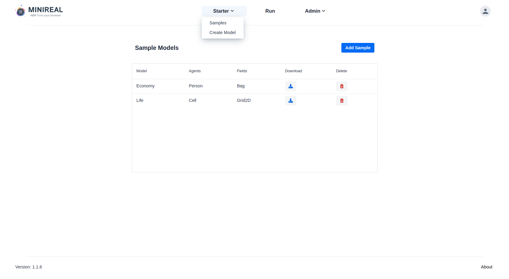
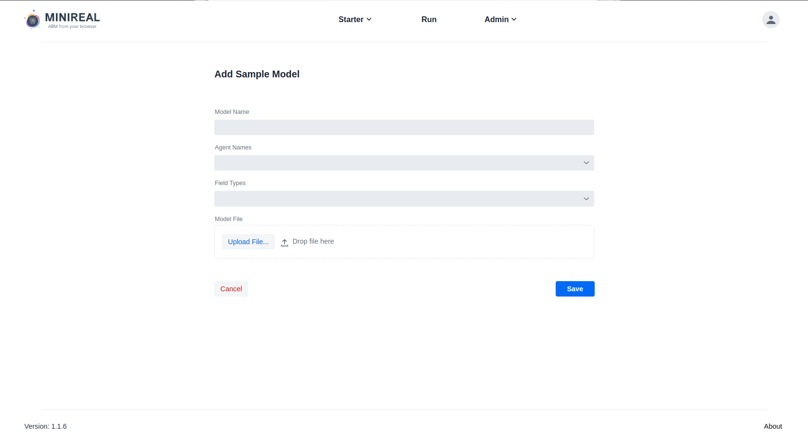
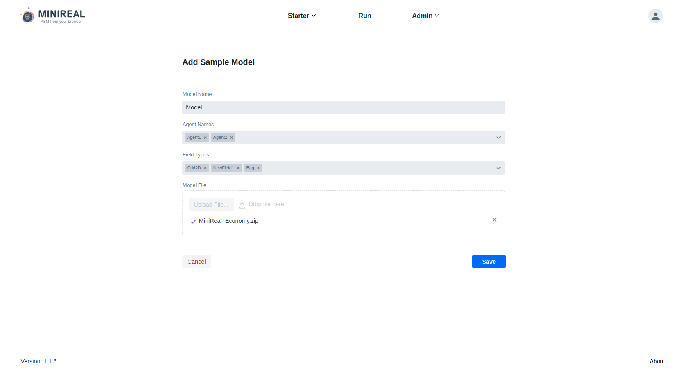
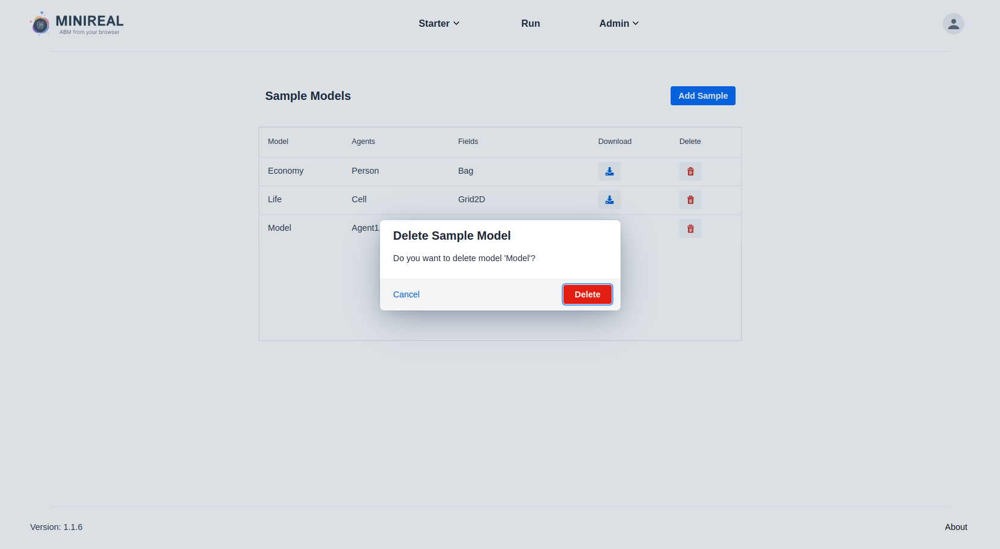

# Managing Sample Models
!!! note
    The definition of `System administrator` is given to users with the role
    of `OWNER` and `ADMIN`.

System administrators can manage this list of Sample Models available on the MiniReal system
by uploading or deleting them. This action is done from the `Sample Models` page. This page
can be access into ways.

* It's the default welcome screen when a user logs into the system.
* Clicking on the `Samples` option in the `Starter` dropdown item found on the navigation bar
will present the `Sample Models` page.

{ align=center }

    Figure: List of Sample Models page

## Uploading New Sample
A new sample model can be added to the system by navigating to the `Add Sample Model` page.
This page can be reached by clicking on the `Add Sample` button found on the `Sample Models`
page.

!!! note
    A sample model to be uploaded to the MiniReal system is a compressed file of the whole
    `Gradle` project structure of the `ABM` codebase.

{ align=center }

    Figure: Add sample model page

 

In the form found in this page, the following information should be entered:

* The name of the Model. This can be a representative name or the class name.
* The name of the Agents. This can be a representative name or the class name.
    - Multiple entries for Agent names can be placed by entering the name and pressing
    the `Enter` key.
* The name of the model field space used. This has a drop-down option of `Bag`, `Grid2D`, or
`Continuous2D`. It's also possible to add a custom field name by simply typing out the field type 
and pressing `Enter`.
    - It's also possible to add multiple field name. It can be done by selecting or typing the
    desired field name and pressing `Enter`.

{ align=center }

    Figure: Filled out add sample model form

 

## Deleting Sample Model
Deleting a sample model is possible by clicking on the delete icon for the respective sample model
on the `Sample Models` page. This action will invoke a confirmation dialog to ensure that
the action was intended for.

{ align=center }

    Figure: Sample Model deletion confirmation dialog

 
