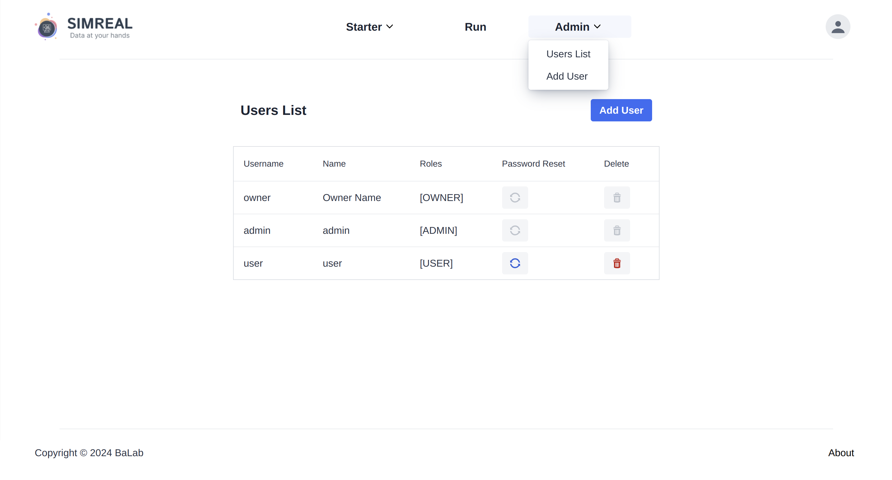
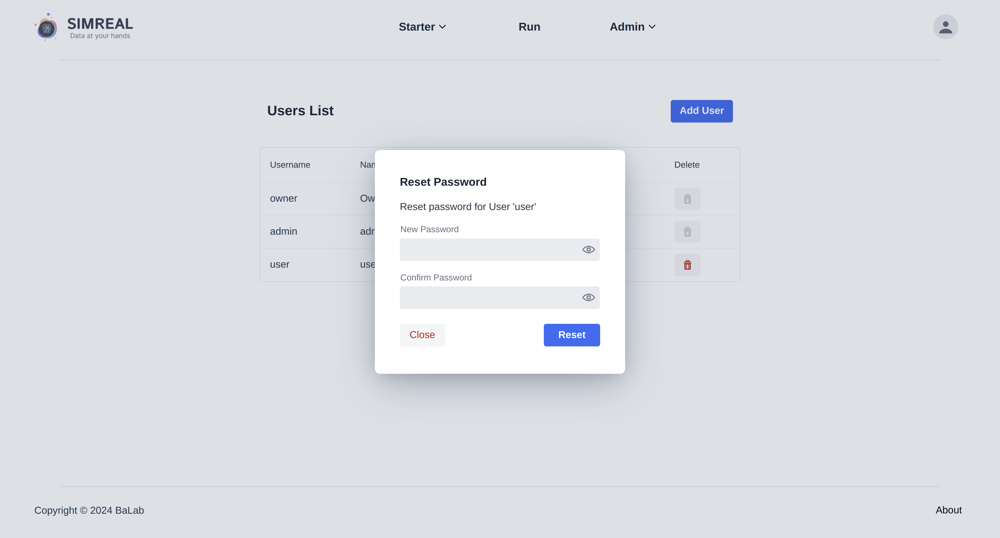
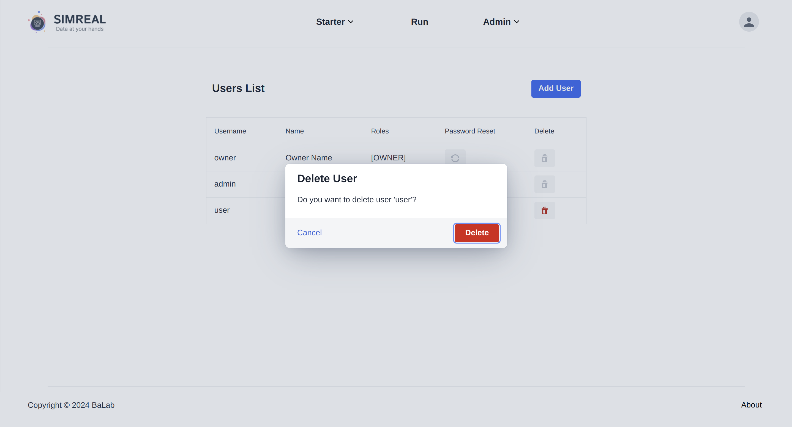

# Managing User Accounts
The MiniReal system provides special features for users with the role of `OWNER`
and `ADMIN`. The type of user roles and their privialge is shown in the following table. 

## User Roles and Permissions

| **Role**   | **Description**     | **ABMS Project**       | **Sample Models**      | **User Management**               |
|------------|---------------------|-------------------------|-----------------------|------------------------------|
| **Owner**  | The user who deploys the web service onto an HPC resource. This role has all system privileges for maintenance and management. | generation, running  | upload, download    | update profile, create owner, create admin, create user |
| **Admin**  | Users who manage samples and other users. This role is one level below the Owner.   | generation, running     | upload, download      | update profile, create user   |
| **User**   | Normal users who run their models on the web service.      | generation, running     | download        | update profile      |

!!! note
    The defintioin of `System administrator` is given to users with the role
    of `OWNER` and `ADMIN`.

## Viewing List of Users
System administrator users can view the list of users registerd on the system by navigating to
the `Users List` page. This page can be reached to by selecting the `Users List`
option from the `Admin` dropdown found at the navigation bar.
{ align=center }

    Figure: List of Users page

## Creating New Users
System adminstrators can create other users with the privilage they have.
Creating new users is possible by filling out the necessary information on the `Add User`
page. This page can be reached through two ways through two ways.

1. It can be done by selecting the `Add User` option from the `Admin` dropdown found
at the navigation bar.
2. Navigate to the `Users List` page. Then from this page clicking on the `Add User` 
button will display the form to create a new user account.

{ align=center }

    Figure: Add User page

The information required to register a new user is:

* username
* name
* password
* confirming the password
* role

!!! warning
    Newly created users should change their password on an initial login since
    the initial password is created by System adminstrators.

## Reseting Password for Users
!!! note
    The action of resting in this context is defined as changing an existing password to a new one.
    System administrator users won't be able to view any password, but can change it when someone
    forgets thier password.

To reset the password for a user, system adminstrators can click on the reset icon
for the respective user on the table found on the `Users List` page. A dialog will pop-up
to request for a new password.

{ align=center }

    Figure: User password reset dialog

## Deleting User Accounts
System administrators can delete user accounts by clicking on the delete icon for 
the respective user from the users list table found on the `Users List` page. This
will invoke a confirmation dialog to ensure that the deletion action is intended.
{ align=center }

    Figure: User deletion confirmation dialog

!!! note
    Users with the `ADMIN` role can add, delete or reset password to users with `USER`
    role only.
    
    However users with the `OWNER` role can add, delete or reset password for all types
    of user roles.