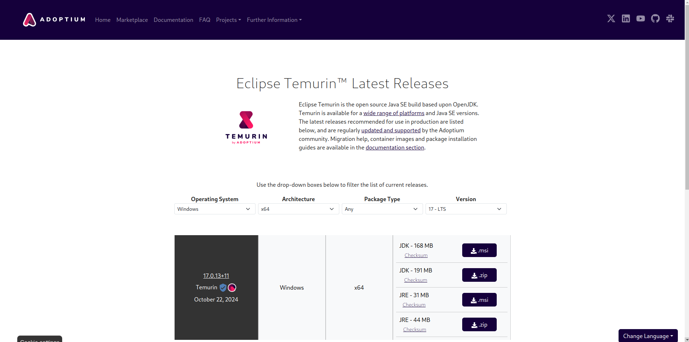

# Installing Java 17 JDK

Due to the need for Gradle version compatability, users must have Java JDK 17 installed
on their system and selected as the default version. The installtion for JDK depends on
Operating System (OS) and users can follow guides avaiable on the internet.

One option is to install an OpenJDK 17 distribution made available by the 
[Adoptium Group](https://adoptium.net/) can be downloaded & installed following this 
[link](https://adoptium.net/temurin/releases/?version=17).

{ align=center }
<p style="text-align: center; font-size: 0.75em;">
    Figure: Temurin JDK 17 download for windows page
</p>

After the completion of the JDK installtion process, users can check its success by
typing the following command on the terminal.

```bash
java --version
```