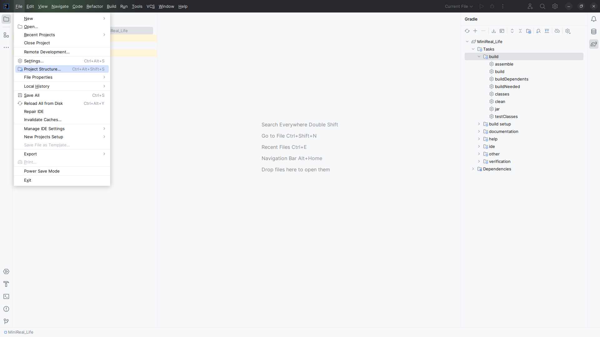
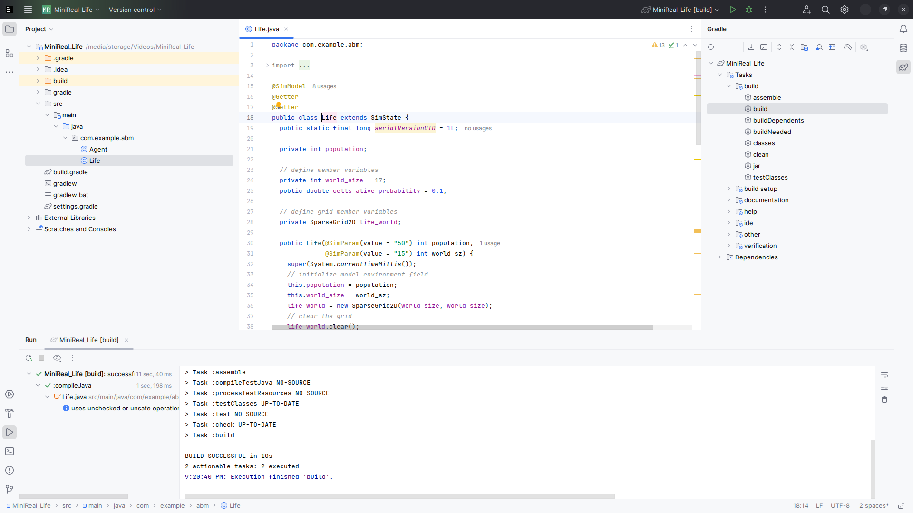

# Setting Intellij IDE Project SDK

The Gradle project for the MiniReal ABM codebase relies on the avalability of Java JDK 17 (see [Installing JDK](./install_jdk.md) ). And when using Intellij IDE, this SDK (Software Development Kit) for Java has to be set accordingly in the OS or IDE. In this documentaion, we will see how to set it up in Intellij IDE.

1. Select the `Project Structure` option from the `Files` tab dropdown list.
  { align=center }
  

      Figure: Navigating to a project settings window from the Files dropdown
  

2. After clicking on the `Project Structure` option, the following popup window will be displayed. This window will show the relevant SDK (JDK) information for the opened project.
  .png){ align=center }
  

      Figure: Project Settings window
  

3. From the `Project Structure` window, select the dropdown component next to the `SDK` label & choose the `Download JDK` option.
  .png){ align=center }
  

      Figure: Selecting download JDK option
  

4. Another small window will pop-up to prompt for the JDK version & vendor. On this
window please select `JDK 17` version provided by the `Eclipse Termurin` vendor, whose
JDK is named `Adopt Open JDK`. And then click on the `Download` button & wait for the process to finish.
  .png){ align=center }
  

      Figure: Downloading Adopt Open JDK 17
  

5. Once the download is completed you can select the recently added JDK from the drop-down option next to the SDK field on the `Project Setting` window. Take note to also select the correct `Language Level` version (which is also 17). Then click on `Apply` & `Ok`.
  .png){ align=center }
  

      Figure: Selecting correct JDK versions
  

6. Finally you can test the correct setup of the JDK version by opening the Gradle side window located on the right-hand side of the IDE. First select the `clean` & then `build` options from the Tasks choice. These steps will build the ABM Gradle project as fresh.
    * `Tasks` -> `build` -> `clean`
    * `Tasks` -> `build` -> `build`

    { align=center }
    

        Figure: Build Gradle ABM project and test correct setup of JDK
    

  

Congratulations on successfully setting up the Java SDK (JDK) for WSim4ABM (MiniReal) Gradle project workflow. You can now perform modeling locally and generate your model
`jar` files conveniently.
